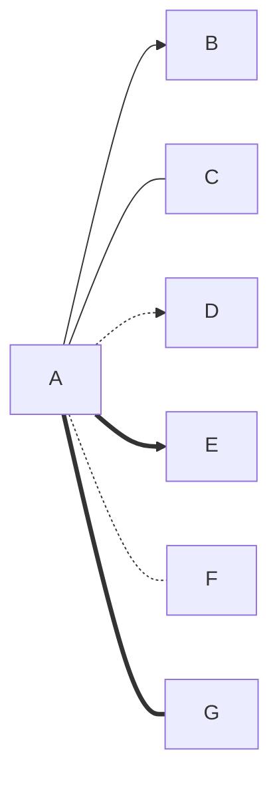
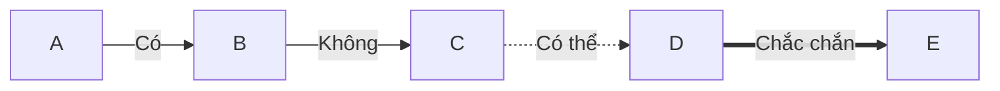
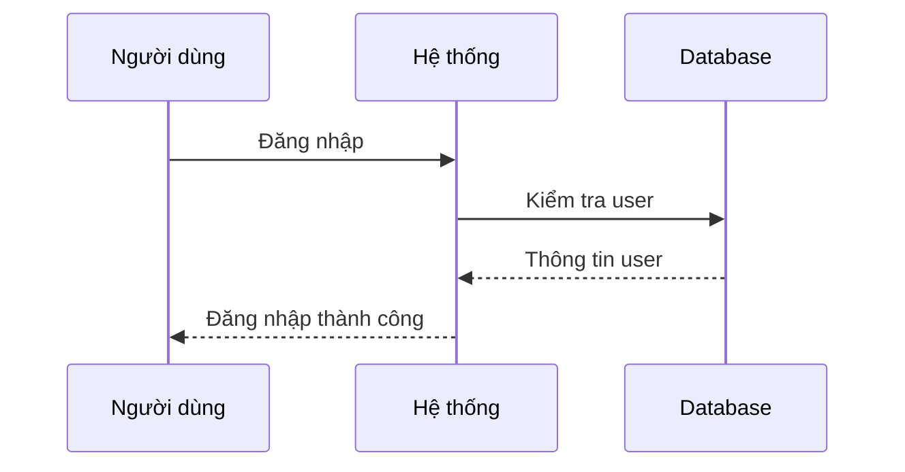

```mermaid
graph LR
A --> B
A --- C
A -.-> D
A ==> E
A -.- F
A === G
```

```mermaid
graph LR
A -->|Có| B
B -->|Không| C
C -.Có thể.-> D
D ==Chắc chắn==> E
```

```mermaid
sequenceDiagram
participant A as Người dùng
participant B as Hệ thống
participant C as Database
A->>B: Đăng nhập
B->>C: Kiểm tra user
C-->>B: Thông tin user
B-->>A: Đăng nhập thành công
```
