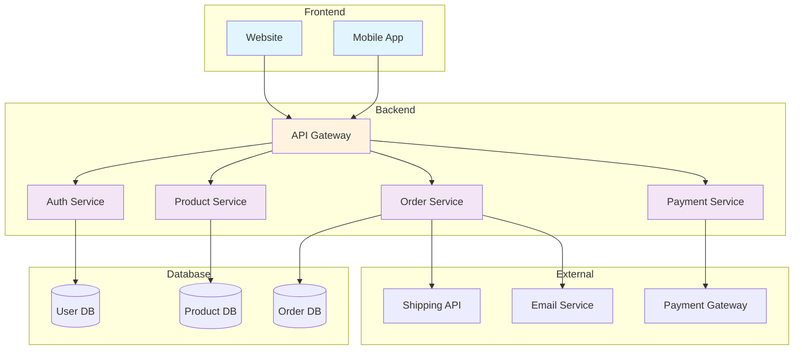

```mermaid
graph TB
subgraph "Frontend"
Web[Website]
Mobile[Mobile App]
end
subgraph "Backend"
API[API Gateway]
Auth[Auth Service]
Product[Product Service]
Order[Order Service]
Payment[Payment Service]
end
subgraph "Database"
UserDB[(User DB)]
ProductDB[(Product DB)]
OrderDB[(Order DB)]
end
subgraph "External"
PayGate[Payment Gateway]
Ship[Shipping API]
Email[Email Service]
end
Web --> API
Mobile --> API
API --> Auth
API --> Product
API --> Order
API --> Payment
Auth --> UserDB
Product --> ProductDB
Order --> OrderDB
Payment --> PayGate
Order --> Ship
Order --> Email
style Web fill:#e1f5fe
style Mobile fill:#e1f5fe
style API fill:#fff3e0
style Auth fill:#f3e5f5
style Product fill:#f3e5f5
style Order fill:#f3e5f5
style Payment fill:#f3e5f5
```
