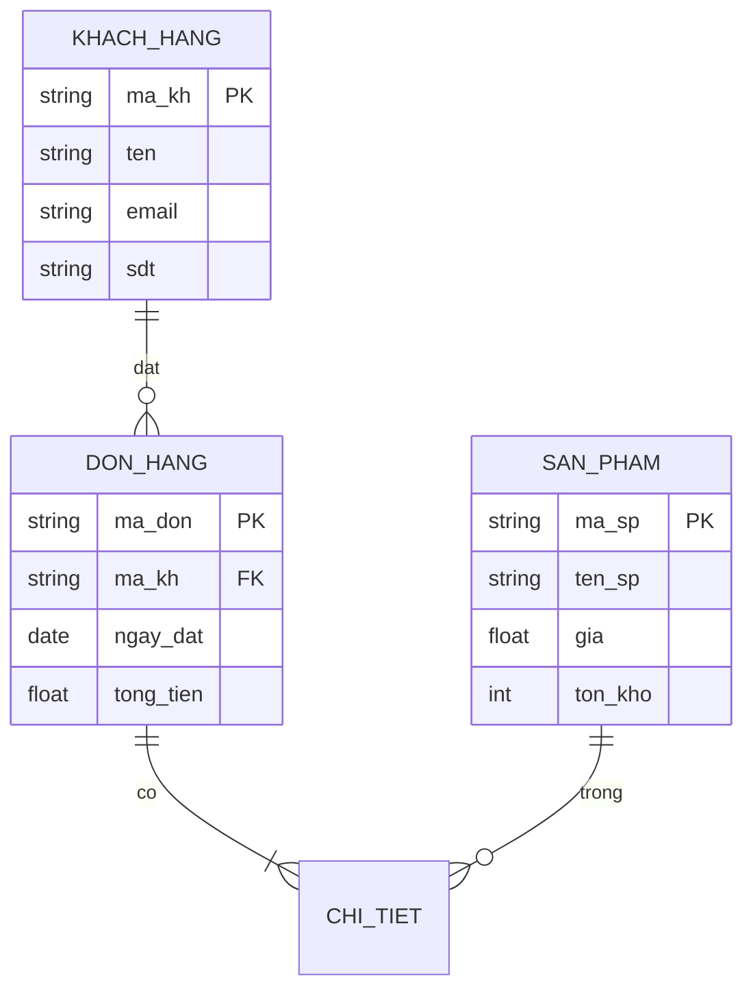

```mermaid
gantt
title Kế hoạch dự án
dateFormat YYYY-MM-DD
section Phân tích
Khảo sát :done, a1, 2024-01-01, 7d
Thiết kế :active, a2, after a1, 10d
section Phát triển
Backend :b1, 2024-01-15, 20d
Frontend :b2, after b1, 15d
section Testing
Test :c1, after b2, 10d
Deploy
